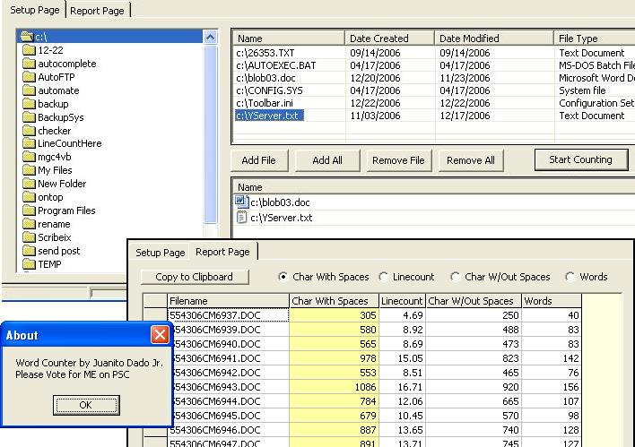

<div align="center">

## Complete Word Counter


</div>

### Description

This is a complete word counter that counts ANY FORMAT like word, excel, txt, csv, xls etc. It counts for Char with or without spaces, word count and linecount. It pretty easy and it counts without the use of Split() function. It uses the word object from the microsoft word 11.0 object library so need referencing. I haven't included exporting but you can at least copy to the line count. The good thing with this one, is that you can simultaneously count up to 500 files plus. I really don't know the maximum limit but it'll depend on the system memory i think. This is good for the transcriptionist industry. Hope this helps to some!!! If you have any suggestions on how I can improve this, just let me know.
 
### More Info
 


<span>             |<span>
---                |---
**Submitted On**   |2006-12-29 05:50:02
**By**             |[Juanito Dado Jr](https://github.com/Planet-Source-Code/PSCIndex/blob/master/ByAuthor/juanito-dado-jr.md)
**Level**          |Beginner
**User Rating**    |5.0 (10 globes from 2 users)
**Compatibility**  |VB 6\.0
**Category**       |[Files/ File Controls/ Input/ Output](https://github.com/Planet-Source-Code/PSCIndex/blob/master/ByCategory/files-file-controls-input-output__1-3.md)
**World**          |[Visual Basic](https://github.com/Planet-Source-Code/PSCIndex/blob/master/ByWorld/visual-basic.md)
**Archive File**   |[Complete\_W20398112292006\.zip](https://github.com/Planet-Source-Code/juanito-dado-jr-complete-word-counter__1-67497/archive/master.zip)

### API Declarations

```
Option Explicit
'progress bar in status bar
Private Declare Function SetParent Lib "user32" _
    (ByVal hWndChild As Long, ByVal hWndNewParent As Long) As Long
```


